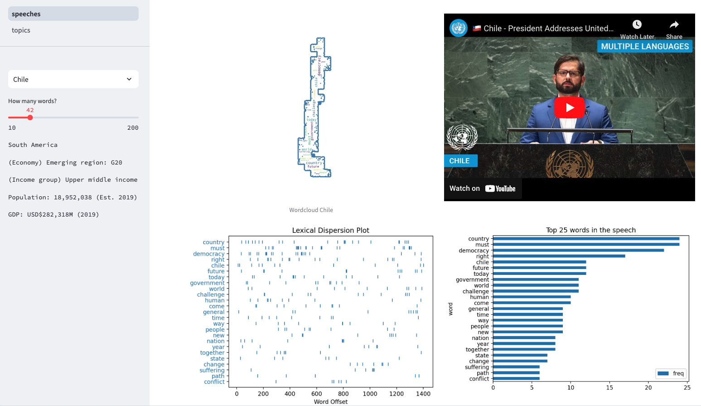
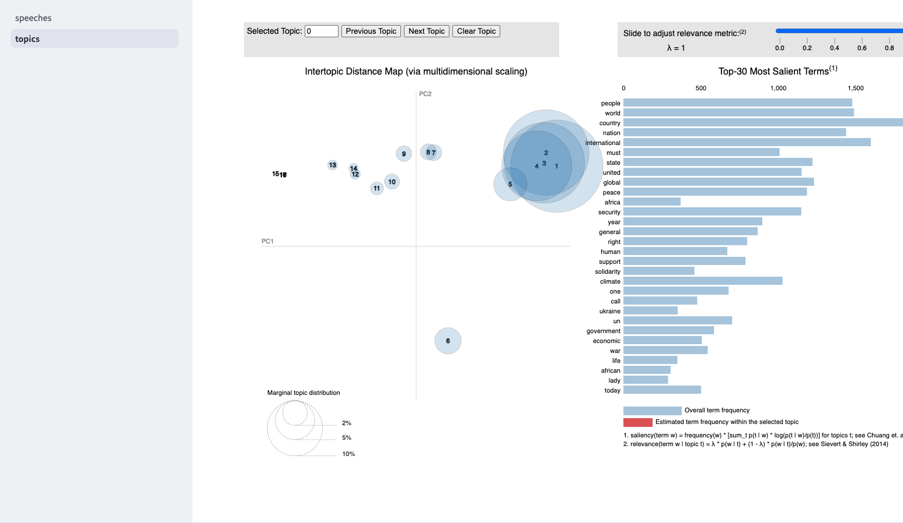

# UN General Assembly 2023 Speech Analysis

[See the app](https://unga-speeches-2023.streamlit.app/)



## Local Usage

```bash
# Clone this repository
git clone https://github.com/darenasc/un-speeches.git
# Change directory to repository
cd un-speeches
# Install dependencies
pipenv install Pipfile
# Activate Python environment
pipenv shell
# Run the streamlit app
streamlit run app/speeches.py
```

## Data

- [UN Speeches](https://docs.google.com/spreadsheets/d/1qtqfnRSW24j-XLN7SRKywDCuFatARCH8pUg1Rr6I2vI/edit#gid=0).
- [Admin 0 – Countries](https://www.naturalearthdata.com/http//www.naturalearthdata.com/download/110m/cultural/ne_110m_admin_0_countries.zip)
